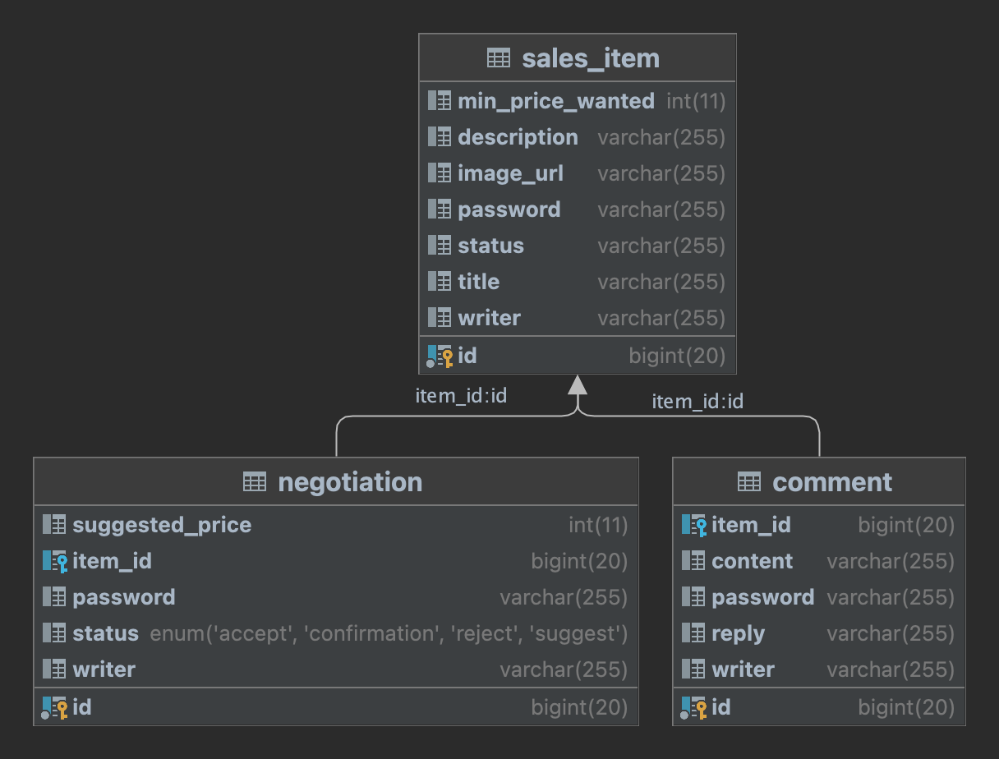

# MiniProject_Basic_ParkJuhee

# 🛒 멋쟁이 사자처럼 백엔드 스쿨 5기 - 멋사 마켓
> 중고거래 플랫폼으로 아이템을 등록하고, 댓글을 이용한 소통, 구매 제안과 구매 확정 기능을 제공합니다.

---- 
## 🔨개발 환경
개발환경 :  
통합 개발 환경 :   
개발 언어 :  
개발 프레임 워크:  
데이터베이스 :   
도구 : 
 

---  

## 📄 요구사항 명세
### 판매자
물픔 등록, 수정, 사진 등록, 댓글에 대한 응답, 제안에 대한 응답을 제공한다.  
추가로 판매자가 제품을 삭제하는 경우 관련 댓글과,응답을 모두 삭제하도록 하였습니다.
제품 등록시점에는 `판매중` 상태로 등록됩니다.
### 댓글 작성자
댓글을 작성, 수정, 삭제, 조회 할 수 있습니다.
### 제안 작성자
제안을 작성, 수정 할 수 있습니다.  
제안 작성 시점에는 `제안`상태로 등록됩니다.  
제안에 대해 판매자가 `수락`한 경우 제안자가 `확정`을 보내면 거래가 완료됩니다.    
거래가 완료되면 해당 아이템에 대한 다른 제안들을 모두 `거절`상태가 됩니다. 또한 아이템의 상태가 `판매완료`로 변경 됩니다.

---

## 👩🏻‍💻 개발
- dev 환경과, test 환경을 분리하였습니다.   
- test 환경에서 snippet한 정보를 바탕으로 restdoc을 생성하였습니다.
- Asciidoctor를 이용하여 html로 rest 명세서를 생성하였습니다.

### API 설계
`Rest docs`, build후 spring boot 실행 후에 실행해주세요 
#### [Comment API 명세서](http://localhost:8080/static/docs/Comment.html) 
[마크다운 파일](src/docs/Comment.md)
#### [Item API 명세서](http://localhost:8080/static/docs/SalesItem.html) 
[마크다운 파일](src/docs/SalesItem.md)
#### [Negotiation API 명세서](http://localhost:8080/static/docs/Negotiation.html)    
[마크다운 파일](src/docs/Negotiation.md)    

`post man json 파일` import 하여 사용할 수 있습니다.
#### [miniporject.postman_collection.json](readme/mutsamarket.json)

--- 

### ER 다이어 그램

jpa를 이용하여 관계 매핑을 진행하였습니다.   
**item**과 **negotiation**의 status 는 enum으로 처리하여 String 으로 저장하였습니다.    

---
### 예외 처리 사항
#### 400 : URL 상의 item id가 다른 객체와 서로 매칭 되지 않는 경우(잘못된 URL)
`CommentNotMatchItemException.java` : 댓글과 아이템의 URL 매치가 되지 않는 경우   
`NegotiationNotMatchItemException.java` : 제안과 아이템의 URL 매치가 되지 않는 경우  
`NegotiationInvalidStatusException.java` : 수락상태가 아닌데 확정하려고 하는 경우  
`InvalidRequestException.java` : 잘못된 요청   

#### 403 : 접근 제한 
`PasswordNotMatchException.java`: 비밀번호가 틀린 경우  
`WriterNameNotMatchException.java` : 아이디가 없는 경우  

#### 404 : 찾고자 하는 아이템을 찾지 못한 경우 
`CommentNotFoundException.java`  
`ItemNotFoundException.java`     
`NegotiationNotFoundException.java`

---

## 프로젝트 실행 기간
1인 프로젝트 2023/06/30 ~ 2023/07/04
