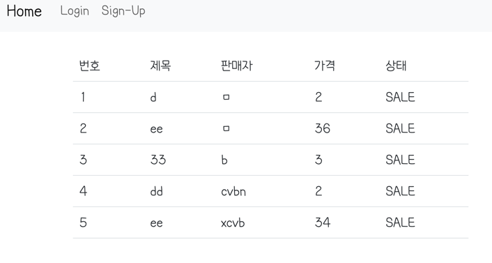

# Project_1_ParkJuhee

# 🛒 멋쟁이 사자처럼 백엔드 스쿨 5기 - 멋사 마켓2
> 중고거래 플랫폼으로 아이템을 등록하고, 댓글을 이용한 소통, 구매 제안과 구매 확정 기능을 제공합니다.
> 추가로 채팅기능을 제공합니다.

---- 
## 🔨개발 환경
개발환경 :  
통합 개발 환경 :      
개발 언어 :   
개발 프레임 워크: 

 
라이브러리 :  
데이터베이스 :   
도구 : 

 

---  

## 📄 요구사항 명세
### 판매자
물픔 등록, 수정, 사진 등록, 물품 수정, 물품 삭제, 댓글에 대한 응답, 제안에 대한 응답 기능을 제공합니다.
추가로 판매자가 제품을 삭제하는 경우 관련 댓글과,응답을 모두 삭제하도록 하였습니다.
제품 등록시점에는 `판매중` 상태로 등록됩니다.
### 댓글 작성자
댓글을 작성, 수정, 삭제, 조회 할 수 있습니다.
### 제안 작성자
제안을 작성, 수정, 삭제 할 수 있습니다.  
제안 작성 시점에는 `제안`상태로 등록됩니다.  
제안에 대해 판매자가 `수락`한 경우 제안자가 `확정`을 보내면 거래가 완료됩니다.    
거래가 완료되면 해당 아이템에 대한 다른 제안들을 모두 `거절`상태가 됩니다. 또한 아이템의 상태가 `판매완료`로 변경 됩니다.

---

## 👩🏻‍💻 개발
- dev 환경과, test 환경을 분리하였습니다.   
- test 환경에서 snippet한 정보를 바탕으로 restdoc을 생성하였습니다.
- Asciidoctor를 이용하여 html로 rest 명세서를 생성하였습니다.
- soft delete를 제공하여 물리삭제가 아닌 논리삭제를 제공하였습니다.
- 웹 화면으로 생성, 조회, 일부 업데이트 까지 제공하였습니다.
- 채팅의 경우 제안자가 판매자에게 채팅을 보내겠다고 클릭하는 순간 채팅방이 유저의 닉네임으로 생성되고(당근마켓) 해당방에 입장에 채팅을 보내게 됩니다. 판매자는 엽라온 채팅탭을 이용하여 자신에게 온 채팅 제안을 확인하고 입장하면서 입장을 알립니다. 그 후에는 서로 데이터를 주고받고 나갔다가 돌아온 이후에도 데이터를 다시 확인할 수 있도록 하였습니다. 
- stomp를 사용하였고, socket헤더의 검증기능을 활용하였습니다. 
- 에러코드의 경우 예외사항이 많아져 모두 삭제하고 ErrorCode를 재 정의 하였습니다.(상태 코드를 자세하게 정의하지 못한 상태입니다)
- 현재 구현상의 오류로.. nickname과 loginId가 동일하여야 채팅이 동작하여 두 인풋이 같지 않으면 회원가입이 될 수 없도록 임시로 막아 두었습니다.
- 프론트 엔드는 리엑트, 타입스크립트, 부트스트랩을 활용하여 구현하였습니다. 
- 아이템 업로드 시에 이미지도 함께 업로드 할 수 있게 하여 아이템 세부 정보에서 아이템 사진을 확인할 수 있도록 하였습니다.

### API 설계(ver1에서 크게 업데이트 하지 않았습니다.)
`Rest docs`, build후 spring boot 실행 후에 실행해주세요 
#### [Comment API 명세서](http://localhost:8080/static/docs/Comment.html)
#### [Item API 명세서](http://localhost:8080/static/docs/SalesItem.html)
#### [Negotiation API 명세서](http://localhost:8080/static/docs/Negotiation.html)    
#### [Negotiation API 명세서](http://localhost:8080/static/docs/Chatroom.html)

`post man json 파일` import 하여 사용할 수 있습니다.
#### [miniporject.postman_collection.json](readme/mutsamarket.json)

--- 

### ER 다이어 그램

 

----

### 프로젝트 실행 방법
스프링 부트 3버전대는 자바 17부터 지원하기 때문에 자바17로 설정되어 있어야 합니다.  
또한 sqlite가 설치되어있어야 합니다. 이번 리엑트를 사용하여 npm이 설지되어 있어야합니다.

다운받고자 하는 파일로 cd 명령어를 이용해서 이동합니다.
1. 깃 클론   
`git clone https://github.com/likelion-backend-5th/MiniProject_Basic_ParkJuhee.git` 을 실행합니다. 
2.  `cd src/main/frontend`로 디렉토리를 이동합니다.
3.  `npm start` 를 실행합니다 - npm 관련 의존성을 설치 해줍니다.
4. `cd ...`하여 본래 프로젝트 폴더로 돌아옵니다. 
5. 그래들을 빌드합니다.  인텔리제이에서는 사이드 바에서 gradle -> build를 실행합니다.그래들이 설치 되어 있다면 cli환경에서 `gradlew build` 을 입력하는 방법도 있습니다.  
6. 빌드 후에는 src/main/resources/static/docs 아래 html파일이 생성된것을 확인할 수 있습니다.
7. cli 환경에서  `java -jar build/libs/market-0.0.1-SNAPSHOT.jar`을 실행시킵니다.

### 페이지 구성
- [home-아이템 확인](http://localhost:8080/)  
- [회원가입 - (채팅 구현시에 오류로  현재는 아이디와 nickname을 동일하게 해야 회원가입이 가능하도록 설정)](http://localhost:8080/signup)  
- [로그인](http://localhost:8080/login)  
- [아이템 추가](http://localhost:8080/item-add-view)  
- [1번 아이템 확인](http://localhost:8080/item-view/1)  
- [나와 관련있는 채팅방 확인](http://localhost:8080/chatroomlist-view)  
- [1번 채팅방 입장](http://localhost:8080/chatroom-view/1)

## 프로젝트 실행 기간
1인 프로젝트   
1차: 2023/06/30 ~ 2023/07/04  
2차: 2023/07/26 ~ 2023/08/12
